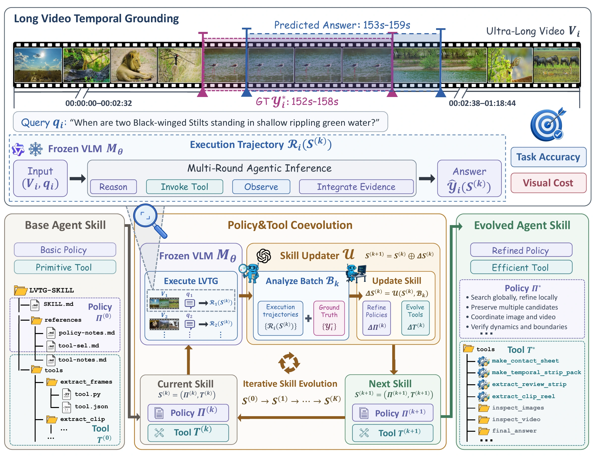
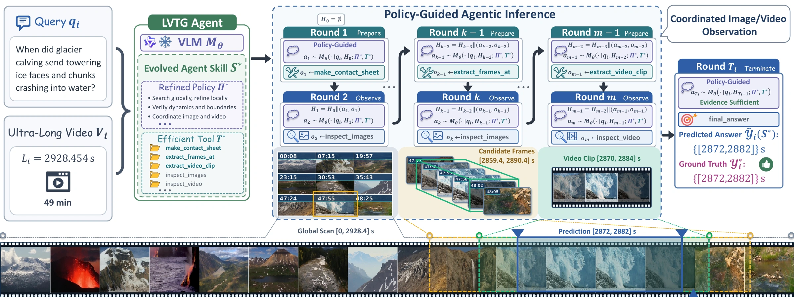
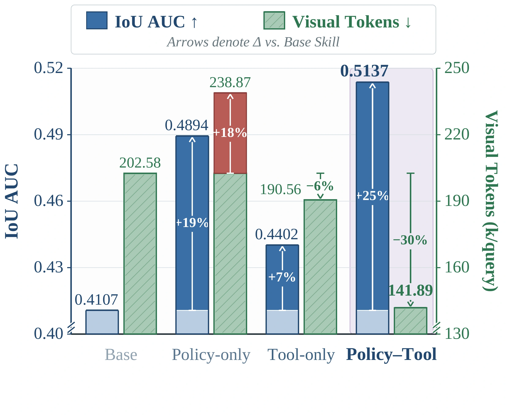
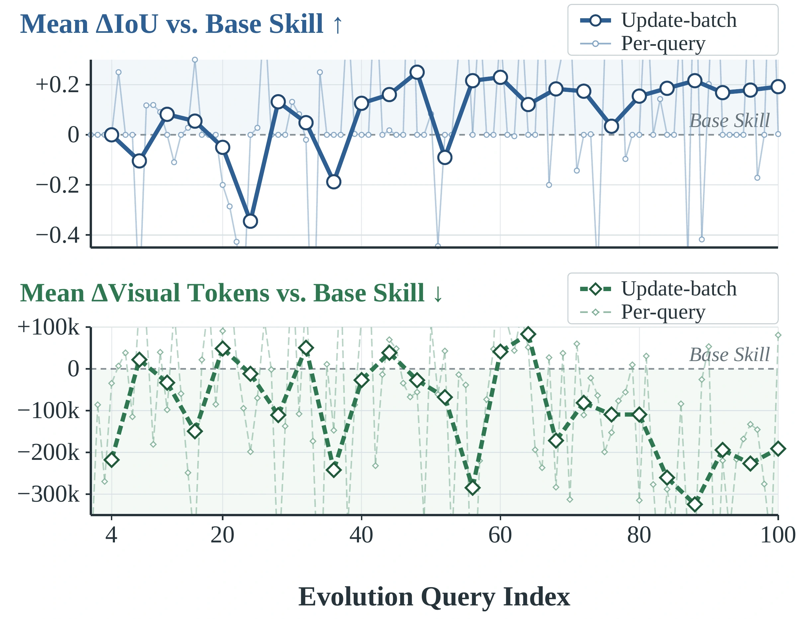
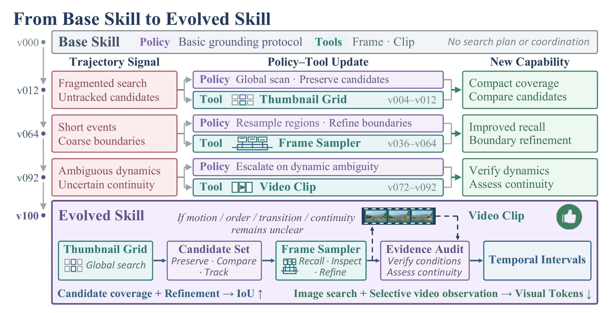

<div align="center">

<picture>
  <source media="(max-width: 600px)" srcset="assets/images/readme/banner-mobile.svg">
  
</picture>

**Yiduo Jia** · **Muzhi Zhu** · **Jinchuan Shi** · **Hao Zhong** · **Yuling Xi** · **Ke Liu** · **Hao Chen**<sup>†</sup>

🎓 **Zhejiang University, State Key Lab of CAD & CG**  
<sup>†</sup> Corresponding author

<a href="https://arxiv.org/abs/2609.40048" title="Read the paper on arXiv"></a>
<a href="https://aim-uofa.github.io/CoEvoWhen/"></a>

<br>

[Abstract](#abstract) · [Method](#framework) · [Results](#results) · [Ablations & Analysis](#analysis) · [Case Study](#case-study) · [Citation](#citation)

</div>

<a name="abstract"></a>

## 📖 Abstract

Ultra-long video temporal grounding requires balancing long-range evidence search with fine-grained event understanding under a limited visual budget, yet existing agentic methods still rely largely on predefined policies and tool capabilities. Motivated by this, we propose a <strong>novel policy–tool coevolution framework</strong> that jointly evolves high-level policies and executable media tools from the agentic reasoning trajectories of a VLM, forming a reusable skill without updating model parameters.

During evolution, an external skill updater distills transferable task experience in long-video temporal grounding, accordingly refining the orchestration of <strong>long-range image-based and fine-grained video-based observations</strong>. Alongside these policy updates, the updater employs its coding capabilities to upgrade existing tools or create new ones, adapting the tools to long-video evidence acquisition.

Equipped with the evolved skill, the VLM <strong>autonomously orchestrates tools</strong> under the guidance of the evolved policy, coordinating image and video observations for agentic inference without relying on a separate, stronger planning model.

Extensive experiments spanning five benchmarks and three VLMs show that policy–tool coevolution consistently <strong>improves temporal grounding accuracy</strong> in ultra-long videos while <strong>reducing visual token cost</strong> at inference, and that the evolved skill yields substantial performance gains on general long-video QA without additional task-specific evolution, demonstrating the effectiveness and generalizability of our framework for long-video understanding.

<a name="highlights"></a>

## ✨ Highlights

-  **Policy–Tool Coevolution.** We jointly evolve high-level policies and executable media tools from a VLM's execution trajectories, distilling ultra-long video grounding experience into a reusable external skill without updating model parameters.
- 🎞️ **Coordinated Image–Video Observation.** We evolve the orchestration of complementary image-based and video-based observations, enabling the VLM to acquire evidence autonomously without manually predefined coordination strategies or a stronger external planner.
- 📈 **Accuracy Gains and Cost Reduction.** Experiments spanning five benchmarks and three VLMs show that policy–tool coevolution consistently improves temporal grounding accuracy in ultra-long videos while reducing visual token cost at inference. The evolved skill also yields substantial performance gains on general long-video QA without additional task-specific evolution.

<a name="framework"></a>

## 🚀 CoEvoWhen Framework

A policy–tool coevolution framework that distills task experience into a reusable external skill for ultra-long video temporal grounding.

### Policy–Tool Coevolution

<div align="center">
  <a href="https://aim-uofa.github.io/CoEvoWhen/#method-evolution">
    
  </a>
</div>

A frozen VLM executes ultra-long video temporal grounding tasks with an external skill comprising high-level policies and executable media tools. Across evolution rounds, an external skill updater distills transferable experience from execution trajectories and task feedback, refining policies for task planning and observation orchestration while synthesizing code to modify existing media tools or create new ones.

### Policy-Guided Agentic Inference

<div align="center">
  <a href="https://aim-uofa.github.io/CoEvoWhen/#method-inference">
    
  </a>
</div>

Image-based observations can provide compact coverage of extended temporal ranges and facilitate comparisons across distant candidate regions, whereas video-based observations preserve local temporal continuity for reasoning about motion, event order, and temporal boundaries.

At inference, the VLM autonomously orchestrates media tools under the guidance of the evolved policy, using accumulated evidence to decide on subsequent observations without relying on a separate, stronger planning model.

<a name="results"></a>

## 📊 Quantitative Results

### Ultra-Long Video Temporal Grounding

Coevolution improves grounding accuracy while simultaneously reducing visual token cost. The results below compare the base and evolved skills on Qwen3.5-27B, with relative gains and cost reductions measured against the base skill.

| <sub>Benchmark</sub> | <sub>Metric</sub> | <sub>Base Skill</sub> | <sub>Evolved Skill</sub> | <sub>Relative Gain</sub> | <sub>Cost Reduction</sub> |
| :--------------- | :------ | ---------: | ------------: | -----------------------: | -----------------------: |
| <sub>VUE-LVTR</sub> | <sub>IoU AUC</sub> | <sub>0.4107</sub> | <sub>**0.5137**</sub> | <sub><strong>↑ 25.1%</strong></sub> | <sub><strong>↓ 30.0%</strong></sub> |
| <sub>ExtremeWhenBench</sub> | <sub>mIoU</sub> | <sub>0.1507</sub> | <sub>**0.2636**</sub> | <sub><strong>↑ 74.9%</strong></sub> | <sub><strong>↓ 11.4%</strong></sub> |
| <sub>CoMET-Bench</sub> | <sub>mIoU</sub> | <sub>0.1355</sub> | <sub>**0.1635**</sub> | <sub><strong>↑ 20.7%</strong></sub> | <sub><strong>↓ 18.9%</strong></sub> |

### Cross-VLM Generalization and Cross-Task Transfer

Consistent gains are also observed when skills are evolved separately on different VLMs. Directly applying the evolved skill to general long-video QA also improves performance without additional task-specific evolution.

**Generalization across VLMs on temporal grounding.** **Bold**: results with the evolved skill. Evolution Gain reports absolute changes, with ↑ indicating relative improvements.

<table>
<thead>
<tr><th rowspan="2"><sub>VLM</sub></th><th rowspan="2"><sub>Method</sub></th><th colspan="3"><sub>VUE-LVTR</sub></th><th colspan="2"><sub>ExtremeWhenBench</sub></th><th colspan="2"><sub>CoMET-Bench</sub></th></tr>
<tr><th><sub>Precision<br>AUC ↑</sub></th><th><sub>Recall<br>AUC ↑</sub></th><th><sub>IoU<br>AUC ↑</sub></th><th><sub>mIoU ↑</sub></th><th><sub>Recall@0.5 ↑</sub></th><th><sub>mIoU ↑</sub></th><th><sub>Rejection-F1 ↑</sub></th></tr>
</thead>
<tbody>
<tr><th rowspan="3" valign="middle"><sub>Qwen3.5-9B</sub></th><td><sub>+ Base Skill</sub></td><td align="center"><sub>0.3240</sub></td><td align="center"><sub>0.3425</sub></td><td align="center"><sub>0.2405</sub></td><td align="center"><sub>0.0626</sub></td><td align="center"><sub>0.0576</sub></td><td align="center"><sub>0.0672</sub></td><td align="center"><sub>67.51</sub></td></tr>
<tr><td><sub><strong>+ Evolved Skill</strong></sub></td><td align="center"><sub><strong>0.4287</strong></sub></td><td align="center"><sub><strong>0.4707</strong></sub></td><td align="center"><sub><strong>0.3244</strong></sub></td><td align="center"><sub><strong>0.1247</strong></sub></td><td align="center"><sub><strong>0.1170</strong></sub></td><td align="center"><sub><strong>0.0852</strong></sub></td><td align="center"><sub><strong>68.80</strong></sub></td></tr>
<tr><td><sub><strong>Evolution Gain</strong></sub></td><td align="center"><sub><strong>+0.1047</strong><br>↑ 32.3%</sub></td><td align="center"><sub><strong>+0.1282</strong><br>↑ 37.4%</sub></td><td align="center"><sub><strong>+0.0839</strong><br>↑ 34.9%</sub></td><td align="center"><sub><strong>+0.0621</strong><br>↑ 99.2%</sub></td><td align="center"><sub><strong>+0.0594</strong><br>↑ 103.1%</sub></td><td align="center"><sub><strong>+0.0180</strong><br>↑ 26.8%</sub></td><td align="center"><sub><strong>+1.29</strong><br>↑ 1.9%</sub></td></tr>
<tr><th rowspan="3" valign="middle"><sub>Qwen3.5-27B</sub></th><td><sub>+ Base Skill</sub></td><td align="center"><sub>0.4706</sub></td><td align="center"><sub>0.4789</sub></td><td align="center"><sub>0.4107</sub></td><td align="center"><sub>0.1507</sub></td><td align="center"><sub>0.1478</sub></td><td align="center"><sub>0.1355</sub></td><td align="center"><sub>66.13</sub></td></tr>
<tr><td><sub><strong>+ Evolved Skill</strong></sub></td><td align="center"><sub><strong>0.5918</strong></sub></td><td align="center"><sub><strong>0.5773</strong></sub></td><td align="center"><sub><strong>0.5137</strong></sub></td><td align="center"><sub><strong>0.2636</strong></sub></td><td align="center"><sub><strong>0.2785</strong></sub></td><td align="center"><sub><strong>0.1635</strong></sub></td><td align="center"><sub><strong>77.06</strong></sub></td></tr>
<tr><td><sub><strong>Evolution Gain</strong></sub></td><td align="center"><sub><strong>+0.1212</strong><br>↑ 25.8%</sub></td><td align="center"><sub><strong>+0.0984</strong><br>↑ 20.5%</sub></td><td align="center"><sub><strong>+0.1030</strong><br>↑ 25.1%</sub></td><td align="center"><sub><strong>+0.1129</strong><br>↑ 74.9%</sub></td><td align="center"><sub><strong>+0.1307</strong><br>↑ 88.4%</sub></td><td align="center"><sub><strong>+0.0280</strong><br>↑ 20.7%</sub></td><td align="center"><sub><strong>+10.93</strong><br>↑ 16.5%</sub></td></tr>
<tr><th rowspan="3" valign="middle"><sub>Qwen3.6-27B</sub></th><td><sub>+ Base Skill</sub></td><td align="center"><sub>0.5098</sub></td><td align="center"><sub>0.5465</sub></td><td align="center"><sub>0.4506</sub></td><td align="center"><sub>0.1691</sub></td><td align="center"><sub>0.1694</sub></td><td align="center"><sub>0.1312</sub></td><td align="center"><sub>68.53</sub></td></tr>
<tr><td><sub><strong>+ Evolved Skill</strong></sub></td><td align="center"><sub><strong>0.5519</strong></sub></td><td align="center"><sub><strong>0.5727</strong></sub></td><td align="center"><sub><strong>0.4985</strong></sub></td><td align="center"><sub><strong>0.2109</strong></sub></td><td align="center"><sub><strong>0.2129</strong></sub></td><td align="center"><sub><strong>0.1477</strong></sub></td><td align="center"><sub><strong>72.37</strong></sub></td></tr>
<tr><td><sub><strong>Evolution Gain</strong></sub></td><td align="center"><sub><strong>+0.0421</strong><br>↑ 8.3%</sub></td><td align="center"><sub><strong>+0.0262</strong><br>↑ 4.8%</sub></td><td align="center"><sub><strong>+0.0479</strong><br>↑ 10.6%</sub></td><td align="center"><sub><strong>+0.0418</strong><br>↑ 24.7%</sub></td><td align="center"><sub><strong>+0.0435</strong><br>↑ 25.7%</sub></td><td align="center"><sub><strong>+0.0165</strong><br>↑ 12.6%</sub></td><td align="center"><sub><strong>+3.84</strong><br>↑ 5.6%</sub></td></tr>
</tbody>
</table>

**Direct transfer to long-video QA.** Overall accuracy is reported in percent. Evolution Gain reports improvements in percentage points, with ↑ indicating relative improvements.

<table>
<thead>
<tr><th rowspan="2"><sub>VLM</sub></th><th rowspan="2"><sub>Method</sub></th><th><sub>LVBench</sub></th><th><sub>LSDBench</sub></th></tr>
<tr><th><sub>Overall Acc. (%) ↑</sub></th><th><sub>Overall Acc. (%) ↑</sub></th></tr>
</thead>
<tbody>
<tr><th rowspan="3" valign="middle"><sub>Qwen3.5-9B</sub></th><td><sub>+ Base Skill</sub></td><td align="center"><sub>40.09</sub></td><td align="center"><sub>49.08</sub></td></tr>
<tr><td><sub><strong>+ Evolved Skill</strong></sub></td><td align="center"><sub><strong>45.84</strong></sub></td><td align="center"><sub><strong>53.68</strong></sub></td></tr>
<tr><td><sub><strong>Evolution Gain</strong></sub></td><td align="center"><sub><strong>+5.75</strong><br>↑ 14.3%</sub></td><td align="center"><sub><strong>+4.60</strong><br>↑ 9.4%</sub></td></tr>
<tr><th rowspan="3" valign="middle"><sub>Qwen3.5-27B</sub></th><td><sub>+ Base Skill</sub></td><td align="center"><sub>45.45</sub></td><td align="center"><sub>61.27</sub></td></tr>
<tr><td><sub><strong>+ Evolved Skill</strong></sub></td><td align="center"><sub><strong>54.10</strong></sub></td><td align="center"><sub><strong>69.25</strong></sub></td></tr>
<tr><td><sub><strong>Evolution Gain</strong></sub></td><td align="center"><sub><strong>+8.65</strong><br>↑ 19.0%</sub></td><td align="center"><sub><strong>+7.98</strong><br>↑ 13.0%</sub></td></tr>
<tr><th rowspan="3" valign="middle"><sub>Qwen3.6-27B</sub></th><td><sub>+ Base Skill</sub></td><td align="center"><sub>48.55</sub></td><td align="center"><sub>61.12</sub></td></tr>
<tr><td><sub><strong>+ Evolved Skill</strong></sub></td><td align="center"><sub><strong>54.36</strong></sub></td><td align="center"><sub><strong>65.64</strong></sub></td></tr>
<tr><td><sub><strong>Evolution Gain</strong></sub></td><td align="center"><sub><strong>+5.81</strong><br>↑ 12.0%</sub></td><td align="center"><sub><strong>+4.52</strong><br>↑ 7.4%</sub></td></tr>
</tbody>
</table>

<a name="analysis"></a>

## 💡 Ablations & Analysis

### Ablation on Policy–Tool Coevolution

**Joint evolution achieves the best accuracy–cost combination.** Policy-only and tool-only variants both improve grounding accuracy over the base skill, confirming policies and tools as effective evolution targets.

<div align="center">
  <a href="assets/images/figures/policy-tool-ablation.webp">
    
  </a>
</div>

On the VUE-LVTR held-out set with Qwen3.5-27B, joint evolution achieves the following relative improvements over the policy-only and tool-only variants:

| <sub>Comparison</sub> | <sub>IoU AUC Improvement</sub> | <sub>Visual Token Reduction</sub> |
| :-------------- | -----------------------: | -----------------------: |
| <sub>vs. Policy-only</sub> | <sub><strong>↑ 5.0%</strong></sub> | <sub><strong>↓ 40.6%</strong></sub> |
| <sub>vs. Tool-only</sub> | <sub><strong>↑ 16.7%</strong></sub> | <sub><strong>↓ 25.5%</strong></sub> |

### Ablation on Image–Video Coordination

Both single-modality variants improve grounding performance through evolution. The evolved image+video skill outperforms both single-modality skills across all grounding metrics while using fewer visual tokens, underscoring the benefits of strategically coordinating their complementary strengths.

Evolved skills on the VUE-LVTR held-out set with Qwen3.5-27B:

| <sub>Observation Mode</sub> | <sub>IoU AUC ↑</sub> | <sub>Visual Tokens (k/query) ↓</sub> |
| :--------------- | ---------: | ------------------------: |
| <sub>Image only</sub> | <sub>0.4374</sub> | <sub>194.60</sub> |
| <sub>Video only</sub> | <sub>0.4772</sub> | <sub>221.98</sub> |
| <sub>Image + video</sub> | <sub>**0.5137**</sub> | <sub>**141.89**</sub> |

### Analysis of Skill Evolution

<div align="center">
  <a href="assets/images/figures/evolution-dynamics.webp">
    
  </a>
  &nbsp;
  <a href="assets/images/figures/skill-evolution.webp">
    
  </a>
</div>

As evolution proceeds, the skill achieves higher grounding accuracy with lower visual token cost more consistently. Candidate omissions, boundary errors, and dynamic ambiguities exposed in trajectories drive coordinated adjustments to observation capabilities and their orchestration.

<a name="case-study"></a>

## 🎬 Case Study

We analyze the execution trajectories of the base and evolved skills on two ExtremeWhenBench queries to illustrate how policy–tool coevolution changes evidence acquisition for action and scene localization in ultra-long videos.

|                        | <sub>Candidate Localization and Motion Verification</sub> | <sub>Long-Range Search and Boundary Refinement</sub> |
| :--------------------- | :----------------------------------------------------------------------------------------------------------------------------------------------------------------: | :-----------------------------------------------------------------------------------------------------------------------------------------------------------------------------------: |
|                        | <a href="https://aim-uofa.github.io/CoEvoWhen/#case-motion"></a> | <a href="https://aim-uofa.github.io/CoEvoWhen/#case-scene"></a> |
| <sub>Video duration</sub> | <sub>50.6 minutes</sub> | <sub>100.1 minutes</sub> |
| <sub>Temporal grounding IoU</sub> | <sub>0.00 → **1.00**</sub> | <sub>0.00 → **1.00**</sub> |
| <sub>Visual token cost</sub> | <sub>198.68k → **96.81k**</sub> | <sub>237.60k → **128.82k**</sub> |
| <sub>Cost reduction</sub> | <sub><strong>↓ 51.27%</strong></sub> | <sub><strong>↓ 45.78%</strong></sub> |
| <sub>Recorded trajectories</sub> | <sub>[View the trajectories →](https://aim-uofa.github.io/CoEvoWhen/#case-motion)</sub> | <sub>[View the trajectories →](https://aim-uofa.github.io/CoEvoWhen/#case-scene)</sub> |

The first case illustrates how better candidate localization allows video observation to focus on verifying query-specific motion, reducing repeated inspection of an incorrect region. The second highlights the importance of discovering a brief target during global search before investing in local boundary refinement.

<a name="citation"></a>

## 📜 Citation

If you find CoEvoWhen useful for your research, please cite:

```bibtex
@misc{jia2026coevowhenpolicytoolcoevolutionultralong,
  title={CoEvoWhen: Policy-Tool Coevolution for Ultra-Long Video Temporal Grounding},
  author={Yiduo Jia and Muzhi Zhu and Jinchuan Shi and Hao Zhong and Yuling Xi and Ke Liu and Hao Chen},
  year={2026},
  eprint={2609.40048},
  archivePrefix={arXiv},
  primaryClass={cs.CV},
  url={https://arxiv.org/abs/2609.40048}
}
```
